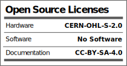
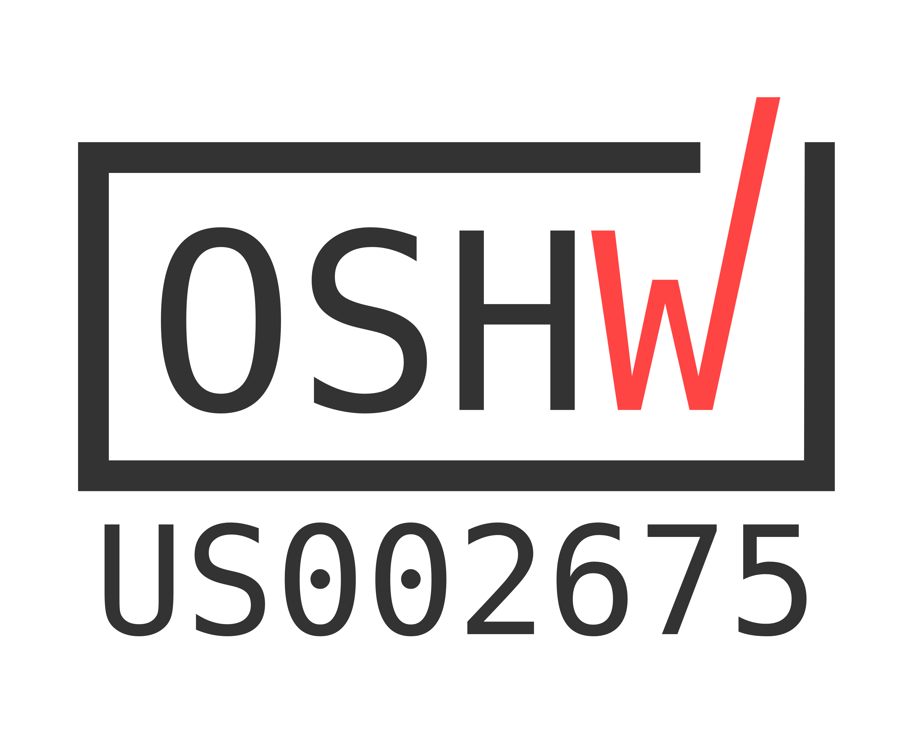
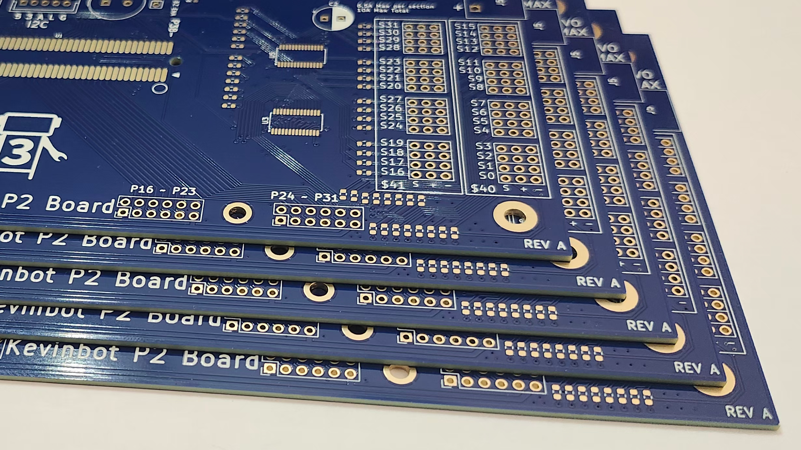

# Kevinbot Core
The KiCAD sources for the Kevinbot Core control board

| | |
|-|-|
||</img>

## Licenses
All hardware is licensed under the CERN-OHL-S-2.0 license. 
Documentation and media (images) are licensed under a CC-BY-SA-4.0 license.

## PCBWay

</img>

Thanks to PCBWay for providing high-quality PCB prototypes.

I would recommend them for any of your PCB needs. They offer fast turnaround and shipping.

[Get a Quote Here](https://www.pcbway.com/orderonline.aspx)

</img>
</img>

## Credits

| Part Name                                        | Credit                                                                           | License                                  |
| ------------------------------------------------ | -------------------------------------------------------------------------------- | ---------------------------------------- |
| 430450400--3DModel-STEP-56544                    | SnapMagic Search                                                                 | Attribution-ShareAlike 4.0 International |
| 1053091102--3DModel-STEP-510211                  | SnapMagic Search                                                                 | Attribution-ShareAlike 4.0 International |
| 1053091103--3DModel-STEP-510211                  | SnapMagic Search                                                                 | Attribution-ShareAlike 4.0 International |
| 1053091106--3DModel-STEP-510211                  | SnapMagic Search                                                                 | Attribution-ShareAlike 4.0 International |
| 1053091108--3DModel-STEP-510211                  | SnapMagic Search                                                                 | Attribution-ShareAlike 4.0 International |