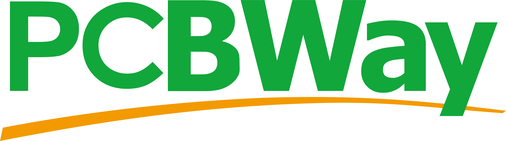
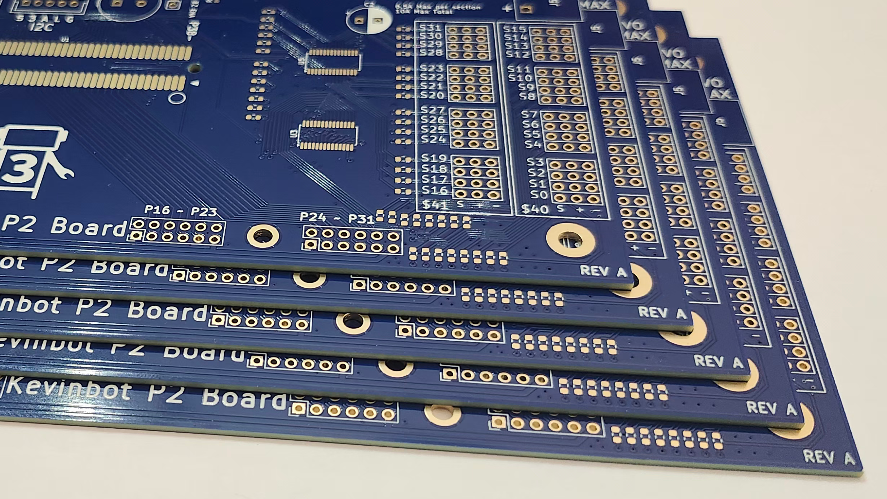

# This repository has moved

Kevinbot Core and the Kevinbot P2 Board have split into separate repositories, and are now located in the [Kevinbot Robotics](https://github.com/Kevinbot-Robotics) organization.

## Kevinbot Core (aka RevB)

https://github.com/Kevinbot-Robotics/kevinbot_core

## Kevinbot P2 Board (aka RevA)

https://github.com/Kevinbot-Robotics/kevinbot_p2_board

## PCBWay

</img>

Thanks to PCBWay for providing high-quality PCB prototypes.

I would recommend them for any of your PCB needs. They offer fast turnaround and shipping.

[Get a Quote Here](https://www.pcbway.com/orderonline.aspx)

</img>
</img>
