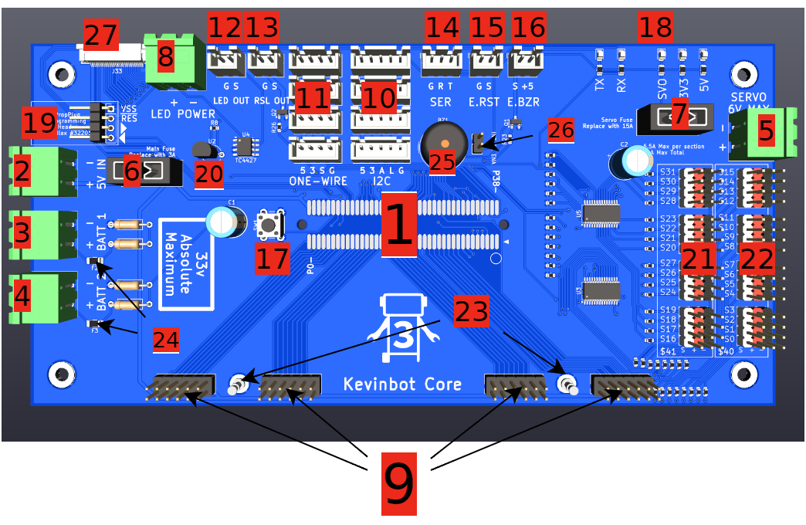

# Board Diagram



## 1. P2 Edge Socket

Parallax Propeller 2 Socket (P2-EC)
<warning>
<b>Warning</b>

Not compatible with 32MB RAM upgrade (P2-EC32MB)
</warning>

## 2. 5V DC Input
    
Maximum Voltage: **5.25v**

Uses [Phoenix Contact MSTBA style connector](https://www.phoenixcontact.com/en-us/products/pcb-plug-mstb-25-2-st-508-1757019)

## 3. Voltmeter for Battery #1

Do not apply more than **33v** to the input, or you will damage the P2.

Uses [Phoenix Contact MSTBA style connector](https://www.phoenixcontact.com/en-us/products/pcb-plug-mstb-25-2-st-508-1757019)

## 4. Voltmeter for Battery #2
   
Do not apply more than **33v** to the input, or you will damage the P2.

Uses [Phoenix Contact MSTBA style connector](https://www.phoenixcontact.com/en-us/products/pcb-plug-mstb-25-2-st-508-1757019)

## 5. Servo Power Input

Power input for the 32 servo ports

<warning>
<b>Warning</b>

Do not exceed 6v on the servo input
</warning>

Uses [Phoenix Contact MSTBA style connector](https://www.phoenixcontact.com/en-us/products/pcb-plug-mstb-25-2-st-508-1757019)

## 6. Main fuse

Fuse for 5v rail. Replace it with **3A** ATM mini fuse

## 7. Servo fuse

Fuse for servo rail. Replace it with **15A** ATM mini fuse

<note>
<b>Current Warning</b>

Exceeding these rating may cause overheating of the board traces and/or connectors
</note>

Servo channel current ratings:

**10A** Max total current

**6.5A** Max for each bank of 16

**3A** Max per channel

## 8. LED Power connector

Power input LED Output.

The voltage going in will be the WS281X(b) signal level

No current will be drawn from this input

<warning>
<b>Warning</b>

This is not a fused input. Install a fuse on the input side for safe operation
</warning>

## 9. P2 Accessory Ports
   
Parallax-compatible P2-EVAL accessory headers.
Compatible with all accessories.

Accessory List:

[Universal Motor Driver](https://www.parallax.com/product/universal-motor-driver-p2-add-on-board/)

[HyperRAM & HyperFlash Add-on](https://www.parallax.com/product/p2-es-eval-board-hyperram-hyperflash-add-on/)

[HD Audio Add-on set](https://www.parallax.com/product/p2-hd-audio-add-on-set/)

[RTC Add-on](https://www.parallax.com/product/p2-rtc-add-on-board/)

[AV Add-on](https://www.parallax.com/product/p2-eval-av-breakout-add-on-board/)

[Serial Host Add-on](https://www.parallax.com/product/p2-eval-serial-host-add-on-board/)

[HUB75 Add-on Board](https://www.parallax.com/product/p2-eval-hub75-adapter-board/)

[LED Matrix](https://www.parallax.com/product/p2-eval-led-matrix-add-on-board/)

[Serial Device Add-on](https://www.parallax.com/product/p2-eval-serial-device-add-on-board/)

[Digital Video Out](https://www.parallax.com/product/p2-eval-digital-video-out-add-on-board/)

[Goertzel Add-on](https://www.parallax.com/product/p2-eval-goertzel-add-on-board/)

[Mini Proto Add-on](https://www.parallax.com/product/p2-eval-mini-prototyping-add-on-board/)

[Control Add-on](https://www.parallax.com/product/p2-eval-control-add-on-board/)

[Proto Add-on](https://www.parallax.com/product/p2-es-eval-protoboard-add-on/)

[microSD Add-on](https://www.parallax.com/product/p2-microsd-add-on-board/)

[P2 to MikroBUS Click](https://www.parallax.com/product/p2-to-mikrobus-click-adapter/)

[WX Adapter](https://www.parallax.com/product/p2-wx-adapter-add-on-board/)
## 10. I2C Ports

Four I<sup>2</sup>C Ports on a common bus

Refer to [Pin Mappings](Pin-Mappings.md) for the internal connections

5v, 3.3v, SDA, SCL, GND starting from the PropPlug side

<warning>
<b>Warning</b>

Do not mix-and-match any of the 3.3v rails.
They have the same voltage, but connecting them may result in damage to your P2.
</warning>

## 11. One-Wire Ports

4 One-Wire Ports on a common bus

Refer to [Pin Mappings](Pin-Mappings.md) for the internal connections

5v, 3.3v, DATA, GND starting from the PropPlug side

<warning>
<b>Warning</b>

Do not mix-and-match any of the 3.3v rails.
They have the same voltage, but connecting them may result in damage to your P2.
</warning>

## 12. LED Output Port

LED Port intended for a single data wire addressable LED segment (such as WS2812b, WS2811, etc...)

Logic level is shifted to the [input](Board-Diagram.md#8-led-power-connector) voltage

## 13. RSL Output Port

The RSL port is intended for a robot status light.
For example, a light that turns on when motors are enabled

Output Voltage: 5v
<br/>
Max Output Current: 1.3A

## 14. UART Communication Port

This port is intended
to be used as a serial communication link between the P2 Board and a main processor like a Raspberry Pi,
or another Kevinbot Core.
While using this port is entirely optional, it may be required for more complex applications.

<tip>
<b>Tip</b>

Using shielded cable is recommended at higher data rates
</tip>

## 15. External Reset Button Port

This port is for an external PC-like reset button.
A connection between the two pins will result in the CPU restarting.

## 16. External Error Buzzer Port

This port is for a software-controlled external Piezo Buzzer.

Output Voltage: 5v
<br/>
Max Output Current: 1.3A

## 17. Reset Button

Pressing the button will result in the CPU and code execution restarting.

## 18. LED Indicators

Indicates power rail statuses and UART port activity.

Light meanings:
<br/>

```Ini
TX = UART transmitting
RX = UART receiving

SVO = Servo power rail
3V3 = P2 V24 rail
5V  = 5V Input rail
```

## 19. PropPlug programming interface

Header for programming the P2. Designed for use with a [Parallax Prop Plug](https://www.parallax.com/product/prop-plug/)

## 20. Internal DS18B20 thermometer

<warning>
<b>Important! Read this!</b>

Every Kevinbot Core will have a different serial number identifier for the thermometer.
It is required to know the serial number if you have any devices connected to the [One-Wire ports](#11-one-wire-ports)
</warning>

## 21. Second Servo Bank

This is the second bank of servo ports (S16 ~ S31)
They are connected to a PCA9685 at I<sup>2</sup>C address `0x41`

Each port has a maximum rating of 3A
<br/>
The whole bank has a rating of 6.5A

## 22. First Servo Bank

This is the first bank of servo ports (S0 ~ S15)
They are connected to a PCA9685 at I<sup>2</sup>C address `0x40`

Each port has a maximum rating of 3A
<br/>
The whole bank has a rating of 6.5A

## 23. Ground test points

These ground points can be invaluable when debugging hardware. Clip your oscilloscope ground to them and debug away!

## 24. Battery Input Polyfuses

These fuses are for the battery voltmeters.
They auto-reset after tripped.
They should never trip unless the board or P2 is damaged in some way.

## 25. Error Buzzer

This is a piezo buzzer intended for error tones.
In the standard [Kevinbot code](https://github.com/meowmeowahr/KevinbotV3-HW-Core),
it will play a startup chime, and continuously beep is an error has occurred.

## 26. Error Buzzer Enabler


This jumper should be installed to enable the internal error buzzer.
If the jumper is not installed, the external buzzer port will still be active.

## 27. Expansion connector

This connector is reserved for future use.
A pinout is provided [here](Pin-Mappings.md)