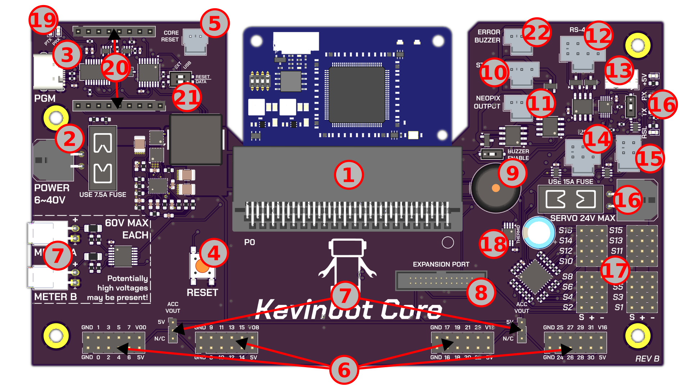

# Board Diagram

## #1 - P2 Edge Socket
Compatible with Parallax P2 Edge ([https://www.parallax.com/product/p2-edge-module/](https://www.parallax.com/product/p2-edge-module/))

!!! warning

    Kevinbot Core is **NOT** compatible with the *P2-EC32MB*

## #2 - Power Input
Kevinbot Core can take anywhere from 6v to 40v. Input is protected by a 7.5A fuse.
 
Operating outside these limits may cause damage to the board.

## #3 - USB-C Programming Header

FTDI Prop-Plug compatible programming interface.
 
Both [#21 DIP Switches](#21-programmer-selector-switches) must be set to **USB** to enable the USB programmer.

## #4 - Reset Button

Press the button to manually reset the P2

## #5 - Reset Header

Connect both pins to reset the P2.
 
Compatible with [Molex 1x2 Nano-Fit connector housings](https://www.molex.com/en-us/products/part-detail/1053071202)

## #6 - P2 EVAL Accessory Headers

Compatible with P2-EVAL accessories. Each header exposes 8 I/O pins, 3.3v, GND, and 5v.

## #7 - Accessory Header 5V Enable

Jumper selector to enable 5V on [#6 accessory headers](#6-p2-eval-accessory-headers)

## #8 - Expansion Port

Reserved for future use.

## #9 - Buzzer

User-controllable buzzer for errors, status, etc...

## #10 - Status Led Port

5v signal level LED header.

!!! note

    It is not recommended to use this for addressable LEDs due to potential slow switching times.

## #11 - Addressable LED Output

5v signal level addressable LED output.

## #12 - RS-422 Input/Output

Serial over 2 twisted pairs. 

!!! note

    The UART Enable Switch must be set to the lower position to enable the RS-422 port.

## #13 - UART Input/Output

3.3v UART RX/TX lines.

!!! note

    The UART Enable Switch must be set to the upper position to enable the UART port.

## #14 - I2C Port

3.3v I2C SDA/SCL lines.

## #15 - One-Wire Port

3.3v One-Wire data.

## #16 - Servo Power Input

Up to 24v servo power input. Protected by a 15A fuse.
 
Operating outside these limits may cause damage to the board.

## #17 - Servo (PWM) Headers

16 PWM headers. Uses a PCA9685 to drive the outputs.

## #18 - Thermometer

DS18B20 One-Wire thermometer.
 
Internally connected to the same One-Wire bus as the [One-Wire Port](#15-one-wire-port)

## #19 - Programmer Indicator LEDs

FTDI activity LEDs.

## #20 - External Programmer Headers

Connection to external programming device. Exposes the P2's Rx/Tx, and flash chip SPI lines.
 
Both [#21 DIP Switches](#21-programmer-selector-switches) must be set to **EXT** to enable the USB programmer.

## #21 - Programmer Selector Switches

Switch between the USB-C and external programming headers.

## #22 - External Error Buzzer Port

External buzzer port with 5v signal level.