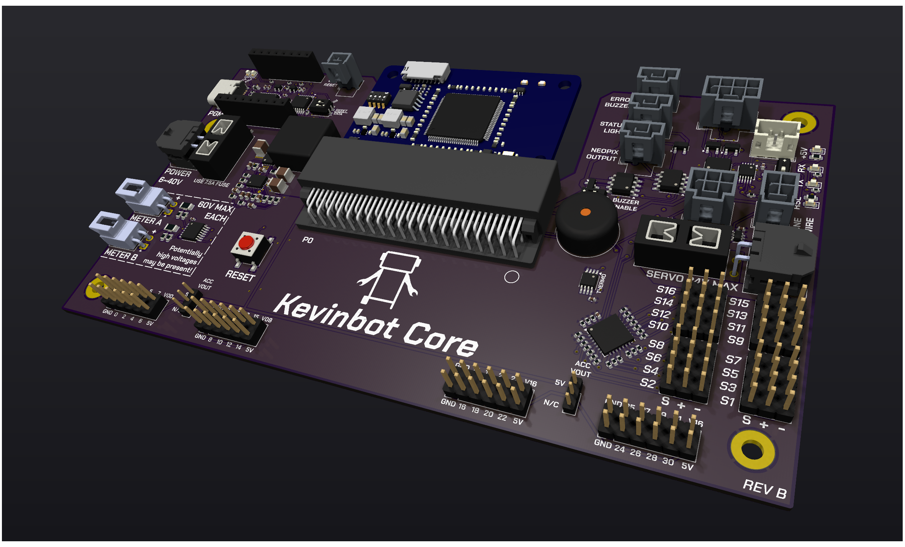

# Image Gallery

## 3D Renders

=== "Black"

    
    

=== "White"

    
    

=== "Blue"

    
    

=== "Green"

    
    

=== "Red"

    
    

=== "Purple"

    
    

=== "Yellow"

    
    
