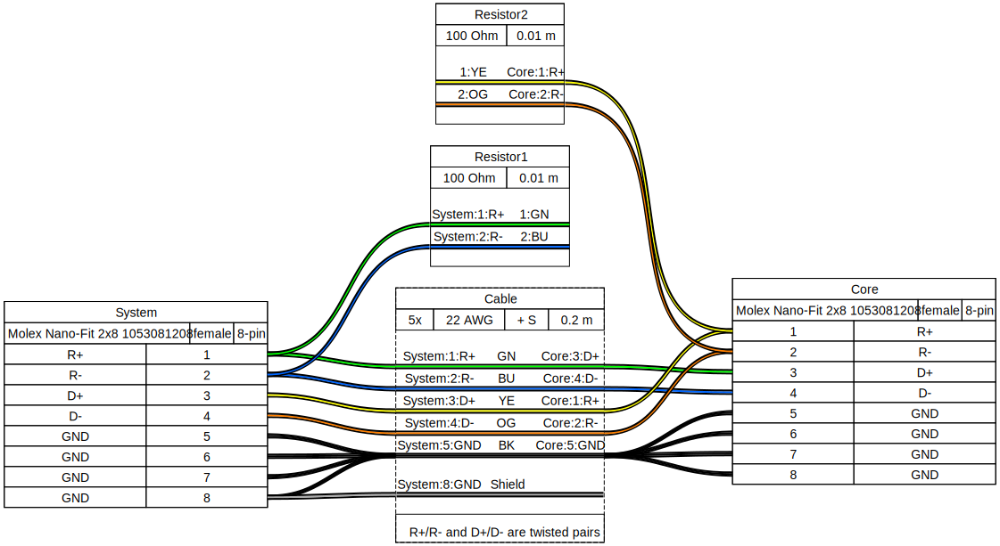
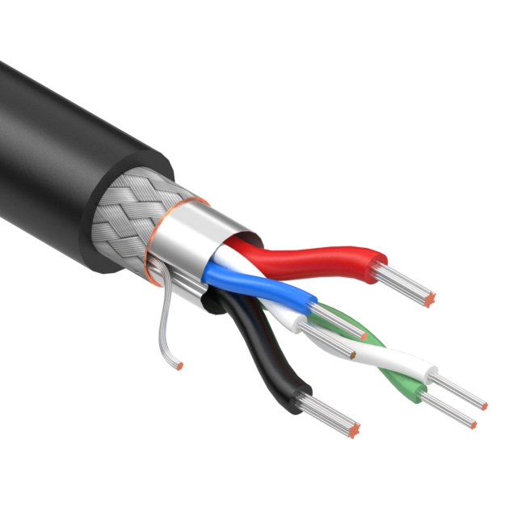

# Wiring Harnesses

## Main RS-422 Communication

/// caption
Core represents the Kevinbot Core
 
System represents the main control system
///

### Cable Options

#### Tensility International Corp 30-02485

{width=200}

[Digi-Key](https://www.digikey.com/en/products/detail/tensility-international-corp/30-02485/16629555)

The Blue/White Pair corresponds to GN/BU
 
The Green/White Pair corresponds to YE/OG
 
The Black and Red Wires are **BOTH** connected to GND at both ends
 
The Shield is connected at pin 8 of the System end
