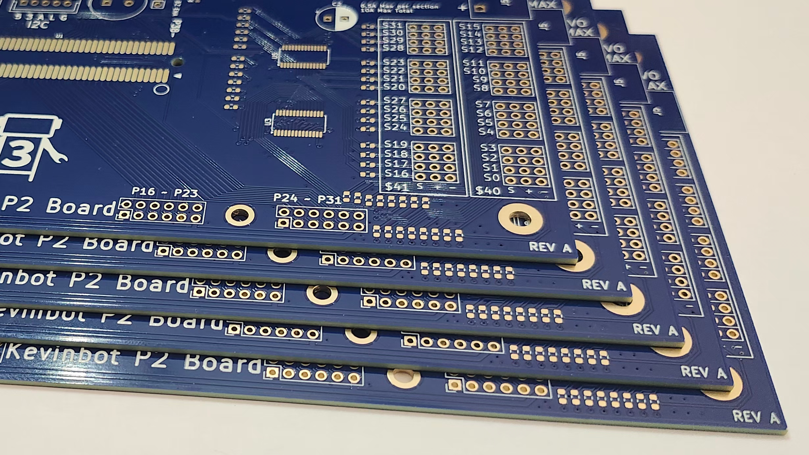

# Kevinbot Core Docs

The Kevinbot Core is a [Parallax Propeller 2 Edge](https://www.parallax.com/product/p2-edge-module/) Breakout 
Board catered for robotics use.
Originally designed only for use in Kevinbot v3, the board can be used for any P2-based robotics project.

## Revision Comparisons

| Rev  | MCU         | Input Voltage | I/O Pins                       | Servo Ports          | Interfaces                        | Programming        | Inbuilt Sensors | Voltmeters                             | Error Buzzer | NeoPixel Output | Status Light Output | Reset Button and Header |
| :--- | :---------- | :------------ | :----------------------------- | :------------------- | :-------------------------------- | :----------------- | :-------------- | :------------------------------------- | :----------- | :-------------- | :------------------ | :---------------------- |
| RevA | Parallax P2 | 5V            | 32 (Accessory), 20 (Expansion) | 32 (Up to 6V power)  | UART, I2C, One-Wire               | PropPlug Interface | DS18B20 Thermo  | 2x Up to 33v                           | ✅           | ✅              | ✅                  | ✅                      |
| RevB | Parallax P2 | 6V ~ 40V      | 32 (Accessory)                 | 16 (Up to 24V power) | RS-422 (_or_ UART), I2C, One-Wire | USB-C              | tbd             | 2x Up to 60v + Input meter (Up to 40v) | ✅           | ✅              | ✅                  | ✅                      |

## Specifications

* Compatible with standard P2 Edge (will not work with the 32 MB option)
* USB-C FTDI Programming Interface
* 16 Servo Outputs
* One-Wire
* I2C
* RS-422
* Status Light Port
* Internal Input Voltmeter + Two External Voltmeters (1v ~ 40v)
* Level-Shifted WS281X(b) port
* Four 2x6 Way P2 accessory headers
* Internal and External Error Buzzer
* Reset Button and External Reset button port
* Internal DS18b20 thermometer
* Fully Open Source Design

## License

All hardware is licensed under the CERN-OHL-S-2.0 license. 
Documentation and media (images) are licensed under a CC-BY-SA-4.0 license.

## PCBWay

</img>

Thanks to PCBWay for providing high-quality and fast PCB prototypes.

I would recommend them for any of your PCB needs. They offer fast turnaround and shipping.

[Get a Quote Here for as low as $5](https://www.pcbway.com/orderonline.aspx)

</img>
</img>
